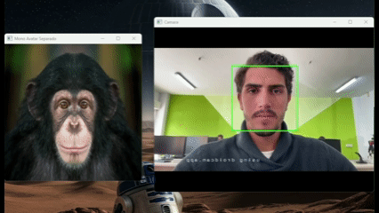
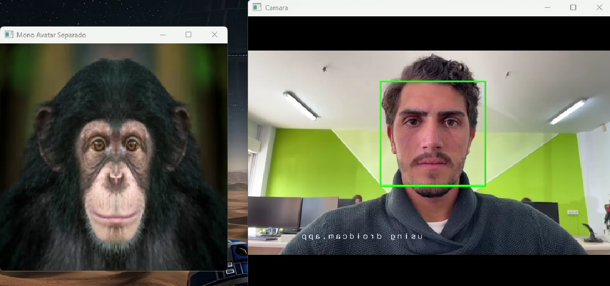
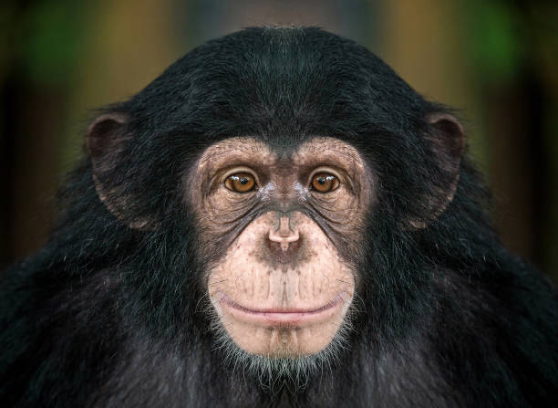
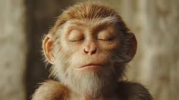

# 🐵 Expresión de Monos


---

## 🎬 Descripción del Proyecto

**Expresión de Monos** es un proyecto en **Python + OpenCV** que detecta en tiempo real **caras, ojos y sonrisas** desde una cámara web o fuente de vídeo (por ejemplo, **DroidCam**) y muestra un **avatar de mono** en una ventana separada.  

El mono cambia su expresión según la detección facial:
- 🐒 **Normal**: cuando no se detectan gestos especiales.  
- 😴 **Ojos cerrados**: si los ojos están parcialmente o completamente cerrados.  
- 😁 **Boca abierta**: cuando se detecta una sonrisa.  

---

## 🧠 Tecnologías Utilizadas

- 🐍 **Python 3.8+**
- 🧮 **NumPy**
- 👁️ **OpenCV** (detección facial con *Haar Cascades*)

---

## ⚙️ Instalación y Ejecución

### 1️⃣ Clonar el repositorio
```bash
git clone https://github.com/tuusuario/expresion-de-monos.git
cd expresion-de-monos
````

### 2️⃣ Instalar dependencias

```bash
pip install opencv-python numpy
```

### 3️⃣ Archivos requeridos

Coloca en la carpeta del script los siguientes archivos:

| Archivo                   | Descripción                                      |
| ------------------------- | ------------------------------------------------ |
| `mono_normal.jpg`         | Imagen por defecto del mono.                     |
| `mono_ojos_cerrados.jpeg` | Imagen del mono con los ojos cerrados.           |
| `mono_boca_abierta.jpeg`  | Imagen del mono sonriendo o con la boca abierta. |

> ⚠️ Asegúrate de tener instalados los archivos de detección facial (`haarcascade_*.xml`) incluidos con OpenCV.
> Estos se cargan automáticamente desde `cv2.data.haarcascades`.

### 4️⃣ Ejecutar el programa

```bash
python cabeza_mono.py
```

Presiona **`q`** o **Ctrl+C** para salir.

---

## 🧩 Funcionamiento Interno

### 📸 1) Detección facial

Se utilizan los **Haar Cascades** preentrenados de OpenCV:

* `haarcascade_frontalface_default.xml` → Detección de cara.
* `haarcascade_eye.xml` → Detección de ojos.
* `haarcascade_smile.xml` → Detección de sonrisa (opcional).

Si los archivos no se encuentran, el programa mostrará un mensaje de error o advertencia.

---

### 🧠 2) Lógica del flujo

1. Se inicializa la cámara y las dos ventanas:

   * 🖼️ **Camara** → muestra el vídeo con detecciones.
   * 🐵 **Mono Avatar** → muestra el mono de expresión correspondiente.

2. Cada frame se reduce (`DETECT_SCALE`) para acelerar la detección facial.

3. Según las detecciones:

   * Si hay **boca/sonrisa** → muestra `mono_boca_abierta`.
   * Si hay pocos ojos detectados → muestra `mono_ojos_cerrados`.
   * En caso contrario → muestra `mono_normal`.

4. La imagen del mono se **ajusta al tamaño de la cara detectada** y se centra en la ventana.

---

## 🎛️ Parámetros Personalizables

| Parámetro          | Descripción                                                 | Valor por defecto |
| ------------------ | ----------------------------------------------------------- | ----------------- |
| `CAM_INDEX`        | Fuente de vídeo (0 para cámara principal o URL de DroidCam) | `1`               |
| `MONO_W`, `MONO_H` | Tamaño fijo de la ventana del mono (px)                     | `400, 400`        |
| `DETECT_SCALE`     | Factor de reducción de la imagen para acelerar la detección | `0.5`             |

> 🔧 **Consejo:**
> Reduce `DETECT_SCALE` (0.4–0.6) para aumentar FPS si tu cámara tiene alta resolución.

---

## 🧰 Solución de Problemas

| Problema                    | Solución                                                                                        |
| --------------------------- | ----------------------------------------------------------------------------------------------- |
| ❌ No detecta sonrisas       | Asegúrate de que `haarcascade_smile.xml` está disponible.                                       |
| ⚠️ Error al cargar imágenes | Verifica que los nombres y rutas sean correctos y sin caracteres especiales.                    |
| 📷 DroidCam no conecta      | Verifica IP y puerto (`http://<IP>:<PORT>/video`) y que ambos dispositivos estén en la misma red. |
| 🐢 FPS bajos                | Reduce `DETECT_SCALE` o baja la resolución de la cámara.                                        |

---

## 🌟 Mejoras Futuras

* Mostrar **varios monos** si se detectan múltiples caras.
* Añadir **trackbars** para ajustar parámetros de detección en tiempo real.
* Sustituir Haar Cascades por un **modelo DNN** o **MediaPipe** para detección avanzada.
* Implementar **landmarks faciales** para alinear el mono con precisión.
* Guardar automáticamente imágenes cuando se detecten expresiones específicas.

---

## 🧑‍💻 Ejemplo de Uso

## 🧩 Demostración

El siguiente ejemplo muestra el funcionamiento del proyecto **Expresión de Monos**.  
La cámara detecta la cara, los ojos y la sonrisa del usuario en tiempo real, mientras una segunda ventana muestra un **avatar de mono** que reacciona a esas expresiones.

---

### 🎥 Vista general

<p align="center">
  
</p>

> 📹 En el GIF se observa cómo el mono **abre la boca cuando el usuario sonríe** y **cierra los ojos cuando el usuario parpadea**.

---

### 🧠 Ventanas del programa

<p align="center">
  
</p>

> 🟢 La ventana **Camara** muestra la detección en vivo con un rectángulo verde sobre el rostro.  
> 🐒 La ventana **Mono Avatar Separado** mantiene un tamaño fijo y centra el mono con la expresión correspondiente.

---

### 📸 Reacciones del mono

| Expresión | Imagen del mono |
|------------|-----------------|
| 😐 Normal |  |
| 😴 Ojos cerrados |  |
| 😁 Boca abierta / sonrisa |  |

> Estas imágenes corresponden a los tres estados posibles del avatar, seleccionados según las detecciones faciales de OpenCV.
---

## 📜 Licencia

Este proyecto se distribuye bajo la licencia [MIT](LICENSE).

---

## ✍️ Autor

**Daniel Sánchez Parra**
💡 Inspirado en sistemas de realidad aumentada simples como filtros de cámara.


